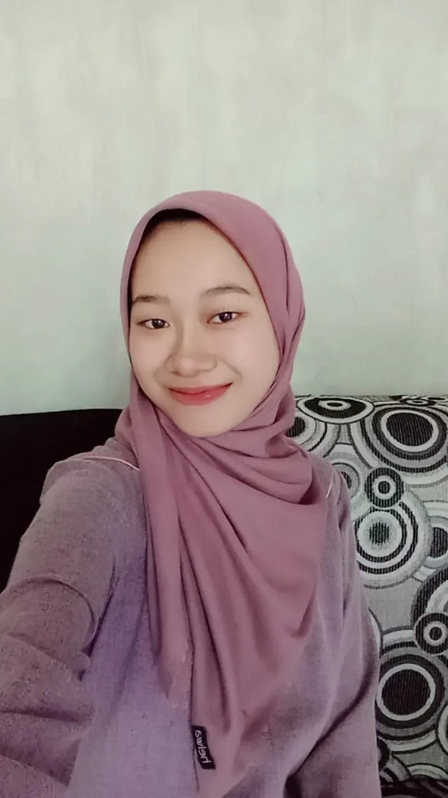
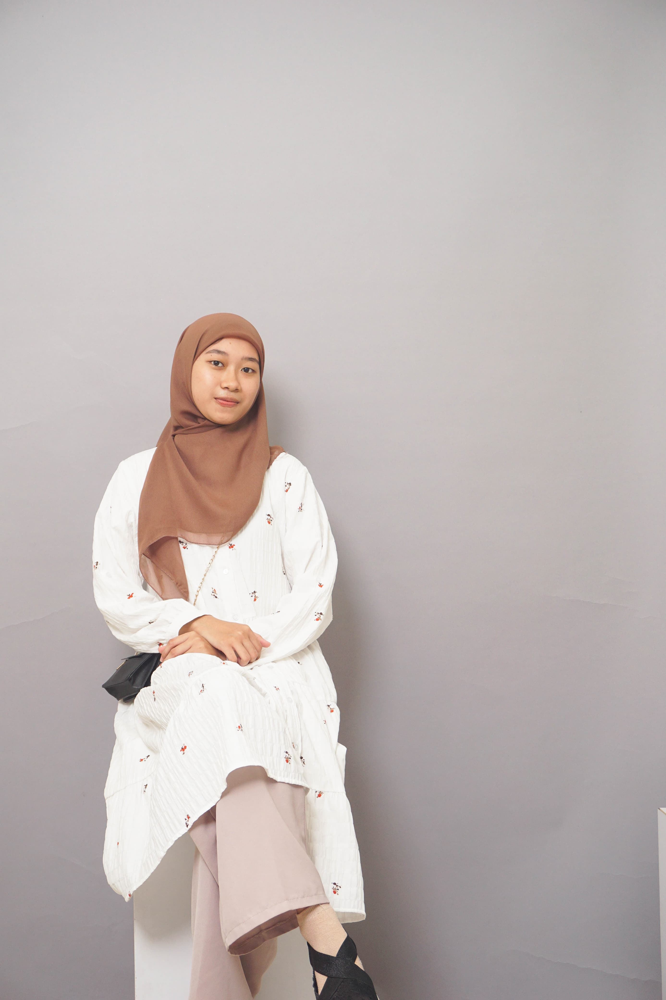
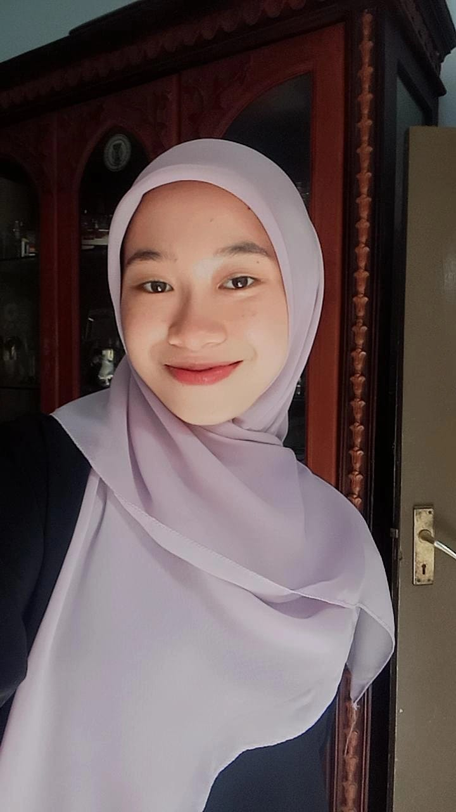

<!DOCTYPE html>
<html lang="id">
<head>
    <meta charset="UTF-8">
    <meta name="viewport" content="width=device-width, initial-scale=1.0">
    <title>Selamat Datang di Webku</title>
    
</head>
<body>
    

        <h1 style="color: hotpink;">🎀 Selamat Datang di Webku 🎀</h1>
        
        
        
        
"Jadilah diri sendiri karena versi asli selalu lebih berharga daripada tiruan."

        
"Hidup itu indah jika kita mengisinya dengan cinta dan kebahagiaan."

        
"Kegagalan adalah awal dari kesuksesan, tetap semangat!"

        <a href="biodataku.html" class="button">💖 Lihat Biodata Lengkap 💖</a>
    

</body>
</html>
